# Muscle BioAmp BisCute

 

[-white)](https://store.upsidedownlabs.tech/product/muscle-bioamp-biscute-diy/)

 
 

Muscle BioAmp BisCute is a cute DIY EMG sensor for precise ElectroMyoGraphy (EMG) at an affordable cost. It comes with a fixed gain of x2420 and BandPass filter of 72Hz - 720Hz. To record the EMG signals you can use any standalone ADC or development board with an ADC of your choice.

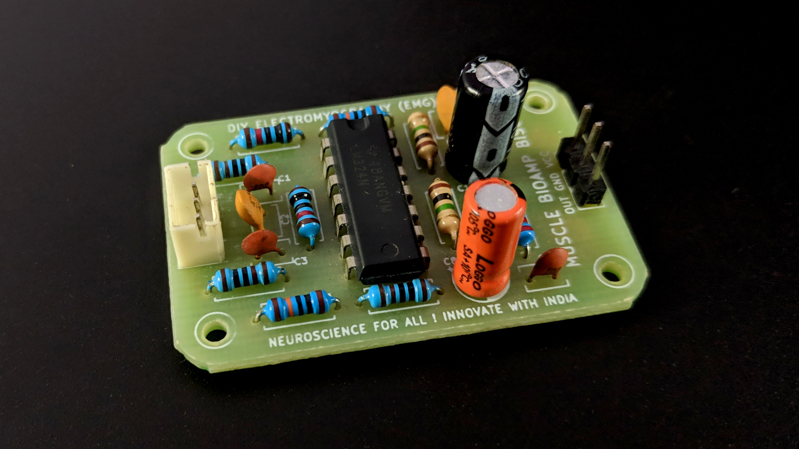

## Hardware

Muscle BioAmp Biscute has been created using KiCad and all the design files can be found under [hardware](hardware/) folder. Images below shows a quick overview of the hardware design.

| PCB Front           |  PCB Back |
| :-------------------------: | :-------------------------: |
|   | 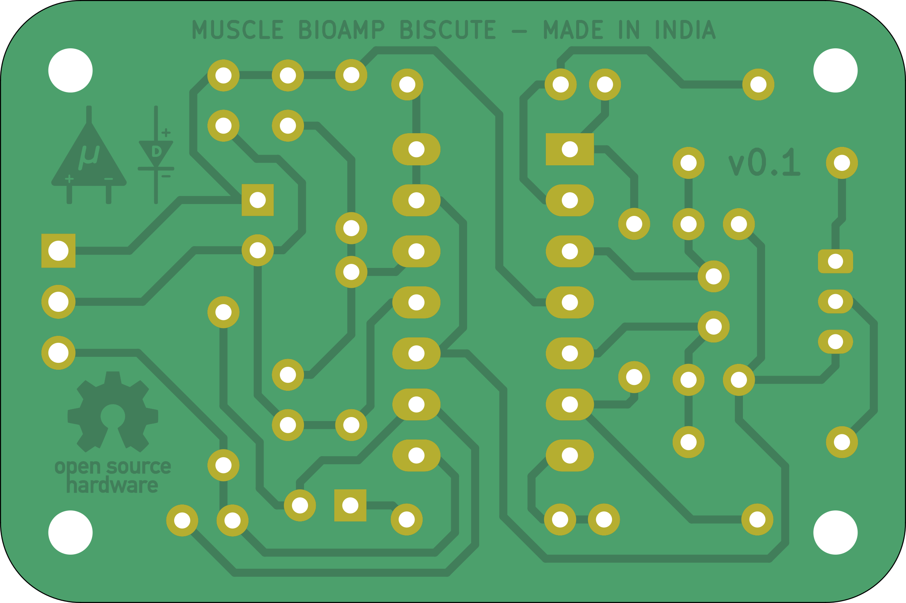 |

### Assembly

You can get your own Muscle BioAmp BisCute bag of parts from [our store](https://store.upsidedownlabs.tech/product/muscle-bioamp-biscute-diy/) or [Tindie](https://www.tindie.com/products/upsidedownlabs/muscle-bioamp-biscute-diy-muscle-sensor/) and for assembling your Biscute you can take a look at [this interactive BOM](https://upsidedownlabs.github.io/Muscle-BioAmp-BisCute/) or the step by step guide below. 

| Step 1 - Bare board | Step 2 - 100K Resistor | Step 3 - 10K Resistor| Step 4 - 1M Resistor|
| :----: | :----: | :----: | :----: |
| |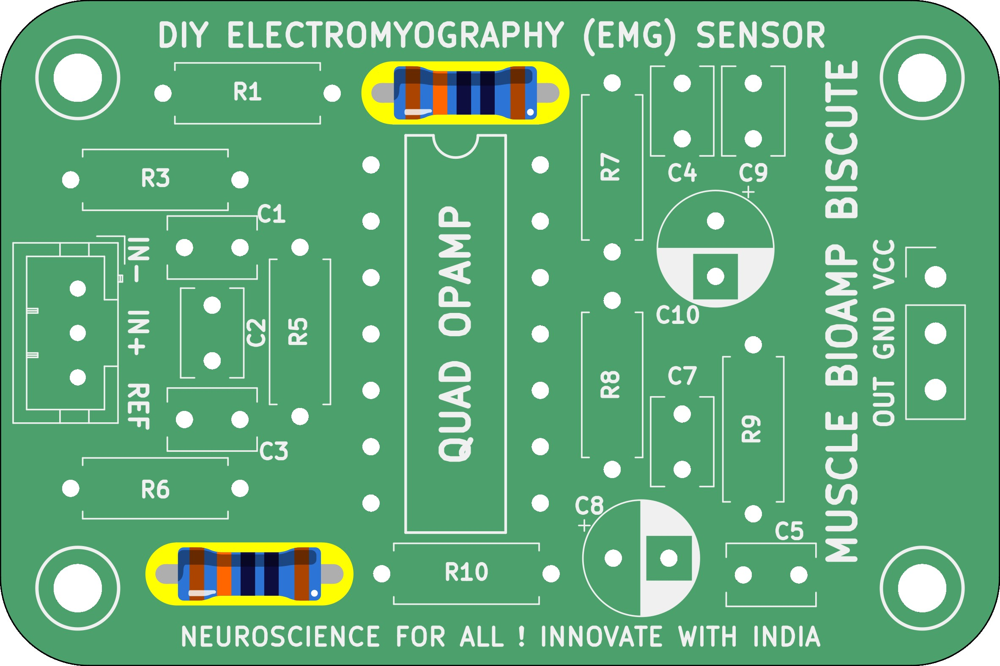||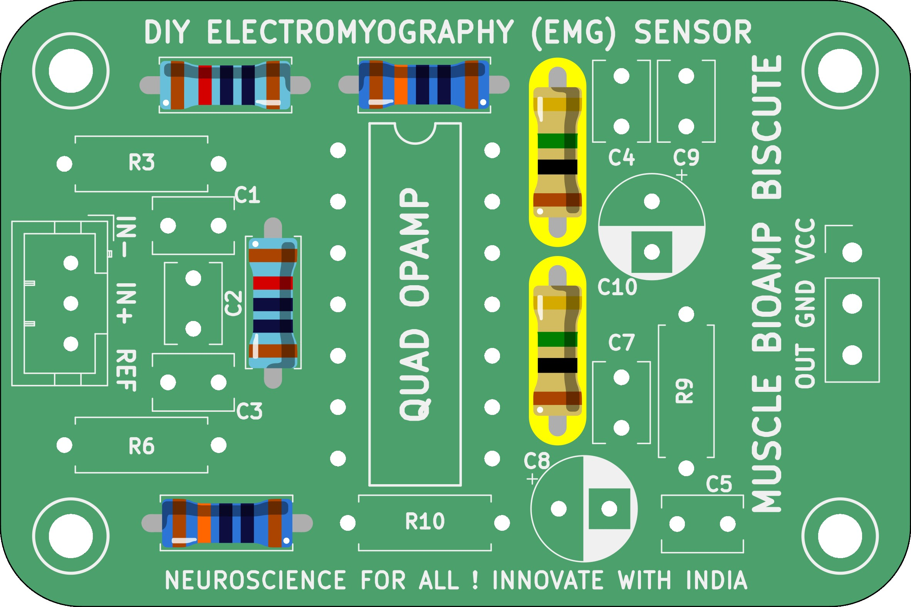|

| Step 5 - 330R Resistor | Step 6 - 220K Resistor | Step 7 - 4.7nF Capacitor | Step 8 - 2.2uF Capacitor |
| :----: | :----: | :----: | :----: |
| 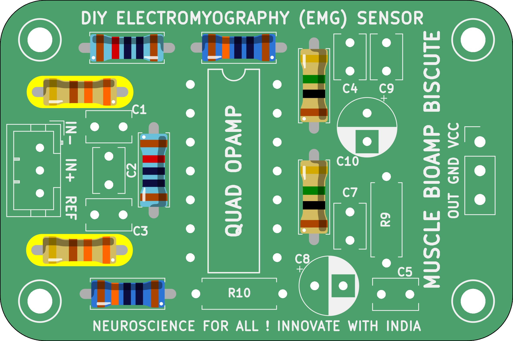|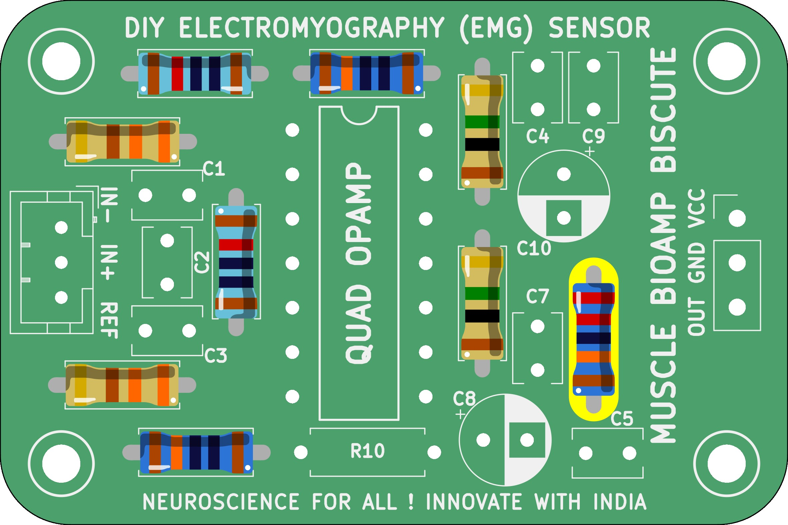|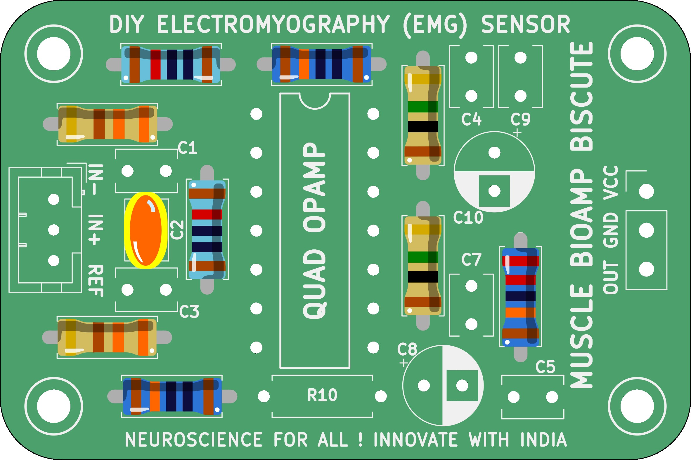|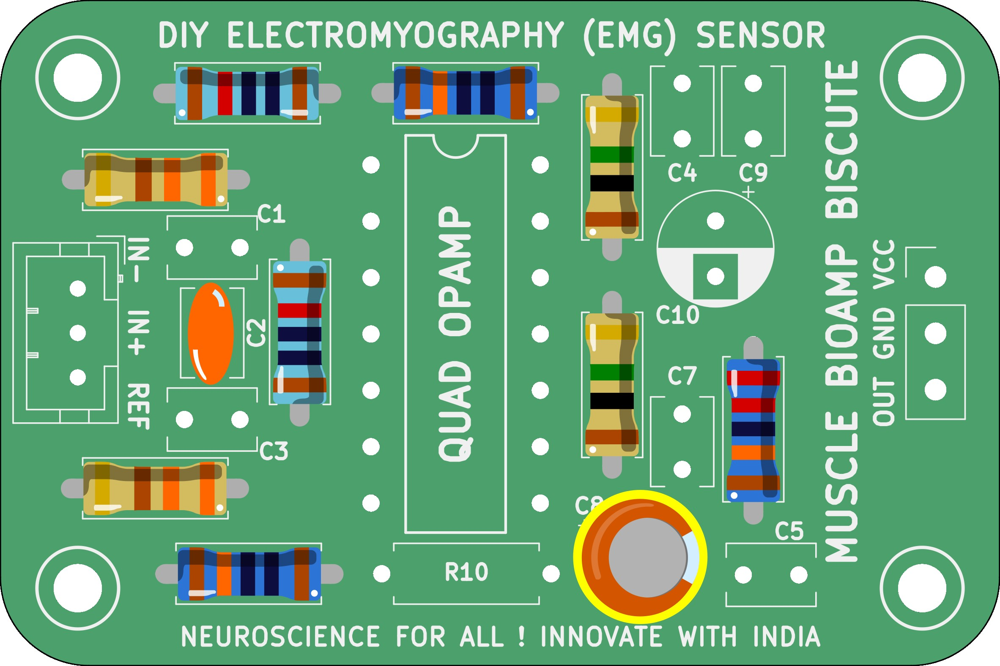|

| Step 9 - 470uF Capacitor | Step 10 - 100nF Capacitor | Step 11 - 1nF Capacitor | Step 13 - 1K Resistor |
| :----: | :----: | :----: | :----: |
| 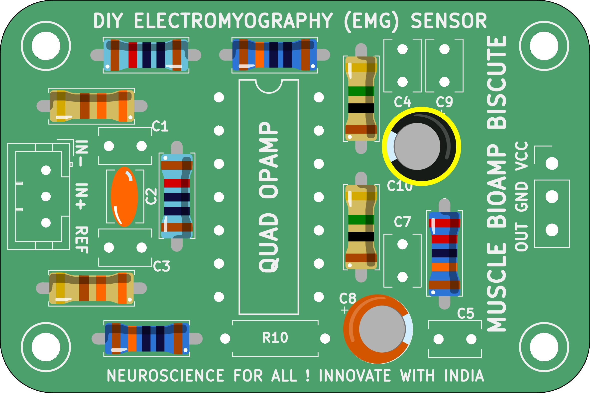|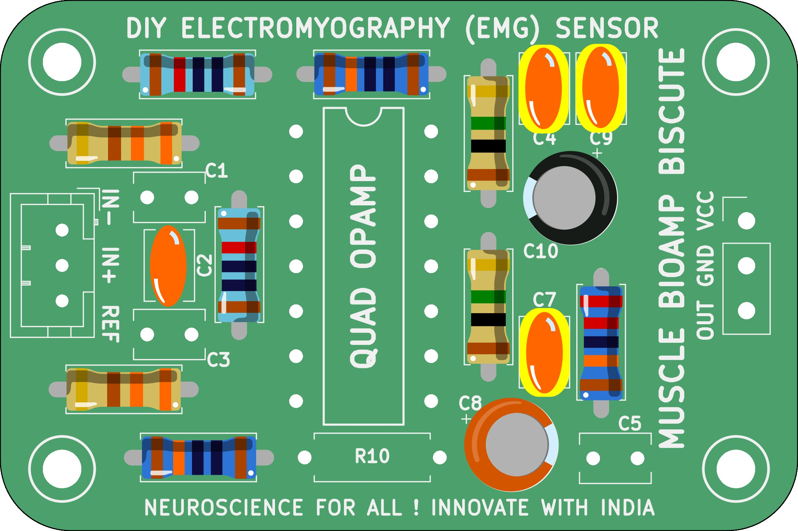|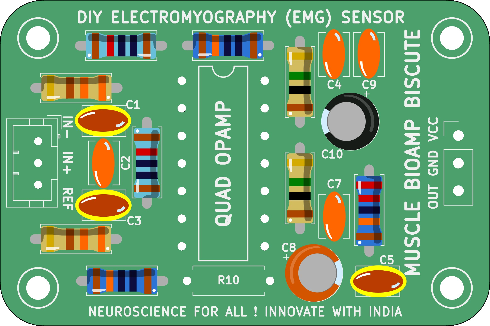||

| Step 13 - BioAmp Connector | Step 14 - Header Pin | Step 15 - IC | Step 16 - Biscute ready |
| :----: | :----: | :----: | :----: |
| 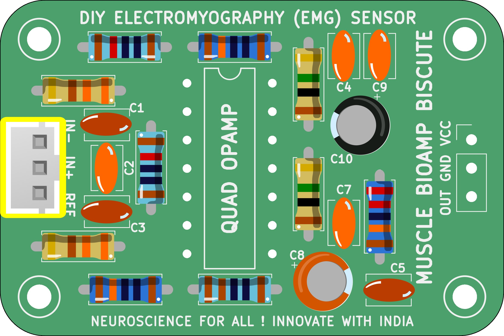|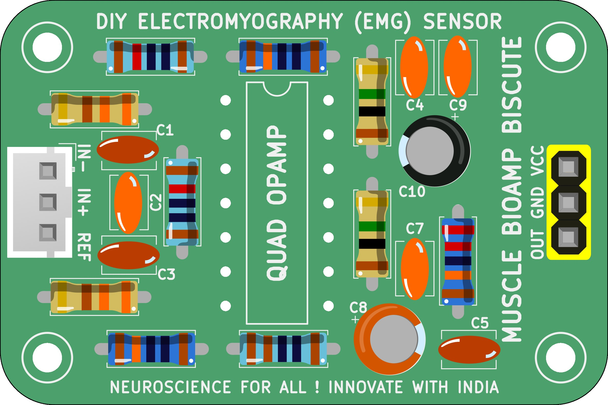|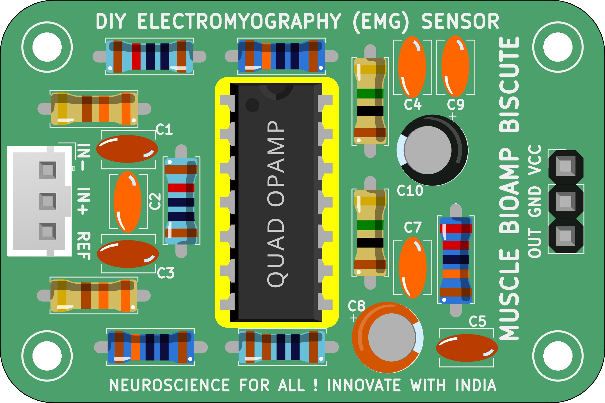||

| Dimensions            |  Schematic  |
| :-------------------------: | :-------------------------: |
|   |  |

## License

| Licenses Facts              |  OSHWA Certification |
| :-------------------------: | :-------------------------: |
|   |  | 

#### Hardware
CERN Open Hardware License Version 2 - Strongly Reciprocal ([CERN-OHL-S-2.0](https://spdx.org/licenses/CERN-OHL-S-2.0.html)).

#### Software
MIT open source [license](http://opensource.org/licenses/MIT).

#### Documentation:
 This work is licensed under a <a rel="license" href="http://creativecommons.org/licenses/by/4.0/">Creative Commons Attribution 4.0 International License</a>.
